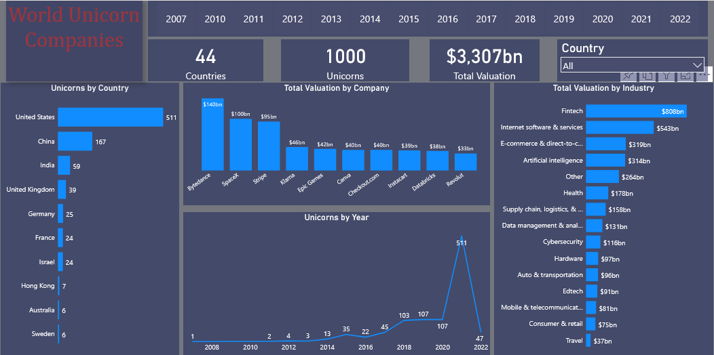

## An Analysis of the world unicorns

<br/>

**Introduction**

1000 Unicorns across 44 countries with a total market valuation of $3,307bn.

<br/>

According to [cbinsights](https://www.cbinsights.com/research-unicorn-companies)
> A unicorn company, or unicorn startup, is a private company with a valuation over $1 billion.
> Variants include a decacorn, valued at over $10 billion, and a hectocorn, valued at over $100 billion

<br/><br/>

**Objective Statment**

- Get insights into the number of unicorns around the world
- Which country of the world has the most unicorns
- Which industry dominates with the highest market valuation
- Potential rising industry for investment

<br/><br/>

**Methodology**

Source Data -  [cbinsights](https://www.cbinsights.com/research-unicorn-companies)

<br/><br/>


**Data Preparation / Data Cleaning**
  
    Power BI, Power Query


<br/><br/>


**Findings**

- Despite the devastating economic effects of the covid-19 global pandemic in 2020, 110 startups attained the unicorn status, with 2021 beinng the year with the highest number, as 570 startups from around the world became unicorns.

- The USA leads as the country with the most unicorns, followed by China and India.

- With a market valuation of $738bn, fintech industry dominates the market, while internet, software and services, ecommerce and artificial intelligence follows suit.

- USA has a total of 98 fintech startups, United Kingdom 23,  India 14, China 8.

- China, however is the leading counry for ecommerce, having a total of 31 startups.
USA dominates in artificial intelligence, fintech, health, internet, software and services.


- **Bytedance**, located in China with a market valuation of $140bn ranks first on the unicorn list, its industry being artificial intelligence.
- Others include in ascending order
  ```
  SpaceX, USA. $140bn
  Stripe, USA. $100bn
  Klarna, Sweden. $45bn
  Epic Games, USA. $42bn

  ```
- Other notable industries worth mentioning include Cybersecurity, supply chain, data management and analysis which respectively has a market valuation above $100bn.

- 2022 seems to be a promising year, as 47 startups have already being elevated to unicorns - 
 <!-- USA 1, India 1, United Kingdom 1, Isreal 1, Canada 1.  -->

Hence we do hope to see more innovations and solutions in the year 2022


<br/><br/>


### Recommendations and Conclusions

- With 5 startups already declared unicorns in 2022, this year promises to see more startups than the previous year.
- Fintech and internet software are expected to see more rapid growth rate.
- Edtech industry also seems promising in the nearest future, with the rise of online schools across different countries.
- Investors looking to invest in edtech and health will get the return on investment (ROI), but this might come at a slow pace.
- For quick ROI however, fintech, others(Automobile), artificial intelligence (AI), cybersecurity are possible areas of investment.


<br/><br/>


## Dashboard 

[](https://app.powerbi.com/groups/me/reports/53a1c412-78b2-4e5d-b2c6-6141fdf675d2/ReportSection)